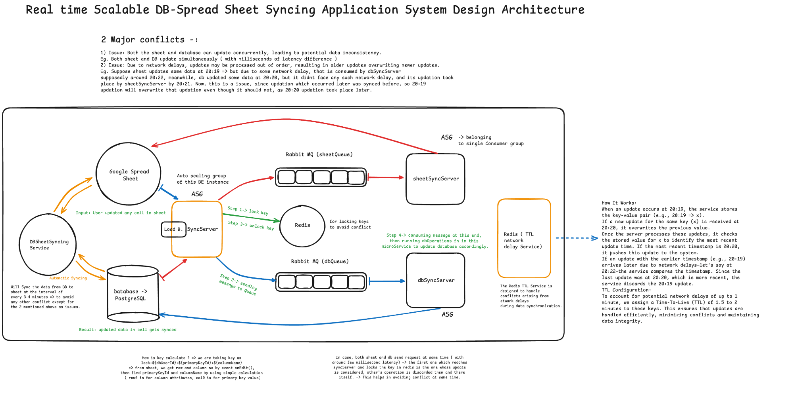

# SyncSheetDB - Sheet & DB Realtime Syncing Application

## Overview

The DB Sheet Syncing Application is designed to efficiently synchronize data between a Google Spreadsheet and a database (PostgreSQL). This project handles bi-directional data syncing, ensuring data consistency across both systems. It uses multiple microservices, message brokers, and Redis to handle conflicts and store user db configurations.

### Live Demo Link: https://drive.google.com/file/d/1x1ixFP_LptrTxwazUQuDaz3cSeYJLYYH/view?usp=sharing

### Architecture Diagram



---

## Project Goals
- **Data Consistency**: Maintain consistency between the Google Sheet and the database.
- **Conflict Resolution**: Handle concurrent and network-delayed updates in a reliable manner.
- **Scalable Architecture**: Use microservices with RabbitMQ and Redis to handle different operations in a scalable manner.

---

## Technologies Used
- **Express**: Library built on Node.js runtime server
- **RabbitMQ**: Message broker for asynchronous communication between services.
- **Redis**: In-memory data store for conflict management and event tracking.
- **Google Sheets API**: To interact with and modify Google Spreadsheet data.
- **PostgreSQL**: Database for data persistence.

---

### Prerequisites
- Node.js (>=14.x)
- Access to Google Cloud Project to set up API credentials (see `sheetSyncServer/config/project_creds.json`)
- PostgreqSQL connection URL

---

## Steps to Run

- **Clone the Repository**:
   ```bash
   git clone https://github.com/Aditya0257/SyncSheetDB.git
   cd SyncSheetDB
   ```

### Docker Way

1. **Update Project Credentials**:
- To make changes in the Sheet, you need to update `project_creds.json` in sheetSyncServer, for authorizing the server to make changes in your google account spreadSheet.
- Navigate to `sheetSyncServer/config/project_creds.json` and update your Google Cloud API credentials.

2. **Update your env variables in docker-compose.yml file**:

3. **Build and Run Docker Containers:**:
  ```bash
  docker compose build
  docker compose up
  ```

 > **Note**: The project_creds.json file can be updated even while the containers are running, as it is mounted as a volume for real-time synchronization.

### Manual Way

1. **Install Dependencies**:
  ```bash
  cd syncServerBE
  npm install
  cd ../dbSyncServer
  npm install
  cd ../sheetSyncServer
  npm install
  cd ..
  ```

2. **Update Project Credentials**:
- To make changes in the Sheet, you need to update `project_creds.json` in sheetSyncServer, for authorizing the server to make changes in your google account spreadSheet.
- Navigate to `sheetSyncServer/config/project_creds.json` and update your Google Cloud API credentials.

3. **Create .env file using .env.example and add your credentials**:
- In the 3 microservices, you will find .env.example file, rename it to .env and put your credentials as asked.

4. **Start the Project**:
  ```bash
  cd syncServerBE
  npm run build
  cd ../dbSyncServer
  npm run build
  cd ../sheetSyncServer
  npm run build
  cd ..
  ```

---

## Rules for Usage

To effectively use the SyncSheetDB application, please adhere to the following rules:

1. **Do Not Edit the Primary Key**:
   - Ensure that you do not modify the `primaryKeyId` in the Google Sheet. This is crucial for the synchronization logic.
   - *Note: Altering the primary key may disrupt the link between the Google Sheet and your database, leading to synchronization errors.*

2. **Schema Requirements**:
   - Your database schema should follow this structure:
   ```sql
   CREATE TABLE testUsers (
       userId UUID PRIMARY KEY DEFAULT gen_random_uuid(), 
       name VARCHAR(255),
       email VARCHAR(255) UNIQUE,
       password VARCHAR(255),
       bio TEXT
   );

 > **Note**: The schema must be fixed to maintain consistent data structures. Changing the schema requires updates to the PostgreSQL trigger function to ensure the synchronization process remains functional. You also need to update the column names in first row of sheet, for simple testing, prefer the given schema.

 3. **Run External Scripts**:
   - The following external scripts need to be executed in the SQL editor of your database:
   
   -- postgresTriggerFunction
      -- [Function script code here](syncServerBE/externalScripts/dbeventFuncScript.txt)

   -- Trigger Event
      -- [Event Triggering Logic Here](syncServerBE/externalScripts/dbeventTriggerScript.txt)

> **Note**: These scripts establish the necessary trigger functions for synchronization. If they are not executed, the application will not know how to respond to changes in your data.

4. **Inserting Data**:
   - When inserting new data, always add it to the next empty row in the Google Sheet. This allows the application to insert data into the database correctly and assign a primaryKeyId to your entry.
   
> **Note**: Inserting data in the correct order prevents conflicts and ensures that each entry receives a unique identifier, essential for maintaining data integrity.

5. **Avoiding Data Overwrites**:
   - Deleting entries is allowed; however, do not delete the primary key. If you delete an entire entry and reinsert it, the application may replace the last used row, potentially overwriting important data.

> **Note**: Preserving the primary key during deletions helps avoid unintentional data loss and maintains the integrity of your records.

6. **Strict Compliance**:
   - Following these rules is essential as this application is a demo testing platform for scalable real-time syncing, which has the potential to evolve into a SaaS product in the future.

> **Note**: Adhering to these guidelines ensures that the application functions as intended, providing a reliable platform for testing and future development.

---

## System Components

### 1. Google Spreadsheet

- Users can make direct changes to the Google Sheet.
- These changes trigger synchronization to the database through our backend services.

### 2. Database (PostgreSQL)

- Acts as the primary data store.
- Changes in the database are automatically synced to the Google Sheet.

### 3. SyncServerBE Service

- Written using typescript, this is the core syncing service that listens to events from both the database and the Google Sheet.
- This service is responsible for detecting changes, determining what needs to be synchronized, and preventing data conflicts.

### 4. Redis

- Conflict Management: **Key => ${dbUserId}:${primaryKeyId}:${columnName}**
- Storing User's **dbUserId** and their database configurations -> host, password and port no.

### 5. RabbitMQ (Message Brokers)

- Two queues are used to ensure proper communication between different microservices:
  1. **sheetQueue**: Handles messages related to changes from Google Sheets that need to be synced to the database.
  2. **dbQueue**: Handles messages related to changes from the database that need to be synced to the Google Sheet.
- The `syncServerBE` service sends data to both RabbitMQ queues.

### 6. sheetSyncServer Service

- A microservice that listens to the `sheetQueue` RabbitMQ and updates the Google Spreadsheet based on the changes received.
- Ensures that the database updates are reflected in the Google Sheet.

### 7. dbSyncServer Service

- A microservice that listens to the `dbQueue` RabbitMQ and updates the database based on the changes made in the Google Sheet.
- Ensures that Google Sheet updates are reflected in the database.

---

## Flow of Events

## Flow of Events

### 1. User Updates a Cell in Google Sheet
1. User modifies any cell in the Google Sheet.
2. **syncServerBE** listens to the updated data through the **API Script** in the Google Spreadsheet.
3. The RedisLock service locks the updated data using its `columnName` and `primaryKeyId` in Redis.
4. The service pushes the data to the `dbQueue` (RabbitMQ Channel).
5. The lock in Redis is released for this changing data.
6. **dbSyncServer** consumes this message from the `dbQueue`.
7. It runs a DB Query for that user's DB to update the data.
8. A PostgreSQL TRIGGER Script in the DB triggers another event.
9. **syncServerBE** listens to the updated data through the **db_update_channel**.
10. The data is locked in Redis, then the message is passed to `sheetQueue`, and the lock is released.
11. **sheetSyncServer** consumes this message from the `sheetQueue`.
12. The respective row and column are updated as required.

> **Note**: This process does not continue in a loop; after the final update in the sheet's cell (Step 12), no event is triggered due to the `onEdit` function in the API Script.

### 2. Database Update
- This is 1 way, since after it updates the cell, No event is triggered.
- **dbSyncServer** consumes the message through **dbQueue** after they are send by **syncServerBE** as explained above.

---

## Conflict Management

### Challenges
1. **Concurrent Updates**: Both systems can be updated simultaneously, leading to inconsistencies.
2. **Network Delays**: Updates can arrive out of order, potentially overwriting newer changes.

### Solutions Implemented
1. **Redis for Conflict Management** - Concurrent Updates : Same data is updated from both sides simulatenously => Redis is used for locking the current updating value by generating lockKeys, then after sending information to RabbitMQ, it releases the lock. This helps in avoiding conflict and improving efficiency, where we give priority to that one, which locks key in **Redis** first.

2. **TTL-based Resolution** - Network Delays : Using TTL expiry of Redis => Stores temporarily the Key of each data updated for 2-3 minutes. This helps in preventing any out of order updates. Eg -> If the same data is updated in sequence, suppose firstly by sheet then by DB within a short timeframe. It helps to avoid network delay. Key -> ${dbUserId}:${primaryKeyId}:${columnName}, this is the coordinate which is monitored in given TTL duration for a particular data.

---

## Synchronization Issue: Out-of-Order Updates Due to Network Delays (TTL Based Resolution)

### Problem Scenario

Suppose the following updates occur:

1. At **20:19**, data - 'x' in the Google Sheet is updated.
   - **Issue**: Due to network delay, this update is only consumed by the `dbSyncServer` at **20:22** and is written to the database then.

2. At **20:20**, same data - 'x' in the database is updated.
   - This update is quickly synced to the Google Sheet by the `sheetSyncServer` at **20:21**, without experiencing network delays.

### Outcome

- The **20:19** Google Sheet update gets applied to the database at **20:22** due to the delay in `dbSyncServer` processing the update.
- Meanwhile, the **20:20** database update gets synced to the Google Sheet at **20:21**.

This leads to a **conflict**:

- The **20:19** update, which was supposed to be applied before the **20:20** update, is **incorrectly overwriting** the **20:20** update in the database due to the delayed sync.
- As a result, **older data** from the **20:19** update overwrites the newer **20:20** data.

### Root Cause
The system processes updates based on when they are received rather than when they actually occurred.

### Solution Considerations
1. **Timestamping Updates**: Include timestamps with updates to process them chronologically.
2. **Version Control**: Track updates to prevent overwriting newer data.
3. **Conflict Resolution Strategy**: Implement policies to handle conflicts appropriately.

---

## Contact and Contributions

For any inquiries, suggestions, or contributions to the project, please reach out via email at [adityasingthakur.0257@gmail.com](mailto:adityasingthakur.0257@gmail.com).

As this project evolves, I welcome open-source contributions. If you're interested in collaborating, feel free to submit pull requests or open issues for discussion.

Thank you for your interest in SyncSheetDB!